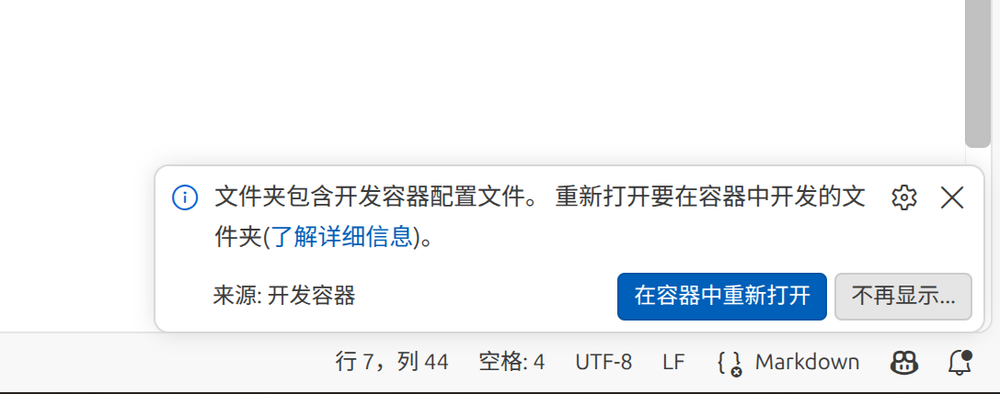
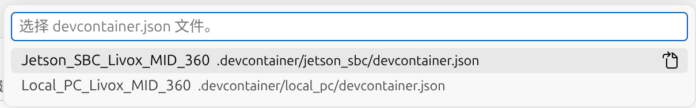
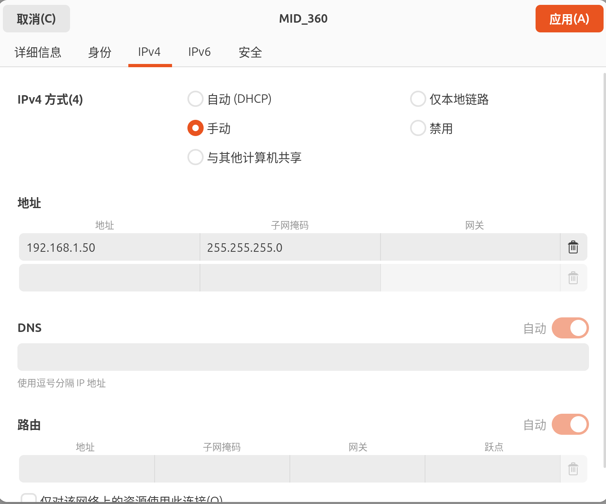

# Jetson部署教程

本教程将从0开始构建一份能跑通本项目的docker容器化环境，适用于端侧部署。

## Remote-SSH 连接

在 VSCode 中安装 Remote - SSH 插件，通过 SSH 连接到 Jetson 端设备，并打开项目目录。

## Docker 容器构建

确保在 VSCode 中已安装 Dev Containers 插件，在 VSCode 中打开本项目根目录，此时右下角会出现：



点击该图标以在容器中重新打开：



选择 Jetson_SBC_Livox_MID_360 后会自动构建 docker 容器，构建完成后会自动进入容器终端。

## 驱动与算法依赖构建

进入容器终端后，构建流程分为两部分：首先在 `/opt` 目录下 `clone` 源码编译并安装全局依赖，随后在工作空间 `src` 目录下 ` clone` 雷达驱动并完成编译。

### 系统级依赖构建与安装

先进入 `/opt` 目录：

```shell
cd /opt
```

再进行源码克隆、编译与安装：

#### 1. LIVOX-SDK2

```shell
git clone https://github.com/Livox-SDK/Livox-SDK2.git
cd ./Livox-SDK2/
mkdir build
cd build
cmake ..
make -j$(nproc)
make install
cd /opt
```

#### 2. Sophus

```shell
git clone https://github.com/strasdat/Sophus.git
cd Sophus
git checkout 1.22.10
mkdir build
cd build
cmake .. -DSOPHUS_USE_BASIC_LOGGING=ON
make -j$(nproc)
make install
cd /opt
```

最后再进行

```shell
echo "/usr/local/lib" | tee /etc/ld.so.conf.d/local_libs.conf
ldconfig
```

### 雷达驱动源码获取与编译

相较于本地部署，端侧部署不需要编译 `pgo` 和 `hba` 两个包，因此需要在工作空间 `src` 目录下创建 `COLCON_IGNORE` 文件：

```shell
touch /workspaces/MID360_QUAD_SLAM/src/lidar_slam_modules/pgo/COLCON_IGNORE
touch /workspaces/MID360_QUAD_SLAM/src/lidar_slam_modules/hba/COLCON_IGNORE
```

 `COLCON_IGNORE` 文件完成后，回到项目根目录下的 `src` 目录：

```shell
cd /workspaces/MID360_QUAD_SLAM/src
git clone https://github.com/Livox-SDK/livox_ros_driver2.git
cd livox_ros_driver2
chmod +x build.sh
source /opt/ros/humble/setup.bash
./build.sh humble
```

编译完成后，回到工作空间根目录并刷新环境：

```shell
cd /workspaces/MID360_QUAD_SLAM
source install/setup.bash
```

再进行全量编译：

```shell
source ./rebuild.sh
```

## 网络配置

这部分可以参考 MID360 雷达驱动的官方文档，主要是配置雷达的 IP 地址和本机的网卡 IP 地址，使得雷达和本机在同一网段下。

### 本地网络配置



### 驱动配置

配置文件路径：`src/livox_ros_driver2/config/MID360_config.json`

编辑配置文件，可参考以下内容：

```json
{
  "lidar_summary_info": {
    "lidar_type": 8
  },
  "MID360": {
    "lidar_net_info": {
      "cmd_data_port": 56100,
      "push_msg_port": 56200,
      "point_data_port": 56300,
      "imu_data_port": 56400,
      "log_data_port": 56500
    },
    "host_net_info": {
      "cmd_data_ip": "192.168.1.50",
      "cmd_data_port": 56101,
      "push_msg_ip": "192.168.1.50",
      "push_msg_port": 56201,
      "point_data_ip": "192.168.1.50",
      "point_data_port": 56301,
      "imu_data_ip": "192.168.1.50",
      "imu_data_port": 56401,
      "log_data_ip": "",
      "log_data_port": 56501
    }
  },
  "lidar_configs": [
    {
      "ip": "192.168.1.119",
      "pcl_data_type": 1,
      "pattern_mode": 0,
      "extrinsic_parameter": {
        "roll": 0.0,
        "pitch": 0.0,
        "yaw": 0.0,
        "x": 0,
        "y": 0,
        "z": 0
      }
    }
  ]
}
```

其中 `lidar_configs.ip`为雷达设备 IP（示例为 192.168.1.119）。

